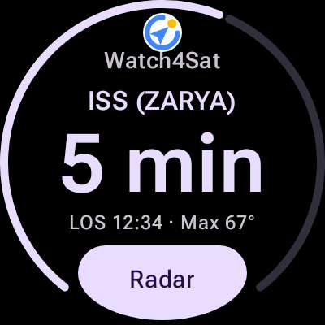

# Watch4Sat

Watch4Sat is a standalone satellite pass tracker for Wear OS. It puts pass
predictions, a wrist-guided radar, ground tracks, radio data, and the next pass
Tile directly on a round watch without requiring a phone companion.

Current source version: **1.0.0-rc.1** (`versionCode 129`)

<p align="center">
  
</p>

## Features

- Tile-first next-pass countdown with active-pass progress
- Pass lists, rise/set times, maximum elevation, and pass alerts
- Full-screen radar with live azimuth/elevation guidance and wrist-aware
  orientation
- Full-screen Orbit Map with satellite switching, ground track, footprint, and
  live satellite details
- Transmitter frequencies and Doppler-adjusted radio information
- GPS or manual ground-station setup
- CelesTrak orbital data and SatNOGS transmitter data
- Online OpenStreetMap tiles with an embedded offline world-map fallback
- English interface
- Round-screen Wear Material 3 UI with Ambient support

## Requirements

- Wear OS device running Android 11 / API 30 or newer
- Network access for orbital and transmitter data refresh
- Location permission only when using GPS-based ground-station setup

Watch4Sat is currently at an immutable RC source checkpoint. No signed
`1.0.0-rc.1` APK or AAB has been produced or published yet. Repository release
builds are minified, non-debuggable, and unsigned. Official APK and AAB signing
is performed only by the maintainer's repository-external release process;
ordinary repository builds are not Play Store production artifacts.

## Build

Open the project in Android Studio, or build from a macOS shell:

```bash
source scripts/watch4sat-env.sh
./gradlew :app-wear:assembleDebug
```

The debug APK is written to:

```text
app-wear/build/outputs/apk/debug/app-wear-debug.apk
```

Run the JVM test suite with:

```bash
source scripts/watch4sat-env.sh
./gradlew test
```

Android SDK paths are loaded by `scripts/watch4sat-env.sh`; `local.properties`
remains machine-specific and is not part of the repository.

## Project Structure

| Module | Purpose |
| --- | --- |
| `app-wear` | Wear OS application, Compose UI, Tile, maps, notifications, and navigation |
| `core-domain` | Orbital prediction, pass planning, Doppler, QTH, and domain models |
| `core-data` | Room, DataStore, network repositories, and cached data |
| `benchmark` | Baseline Profile generation and minified runtime smoke coverage |

When a release is published, its release page identifies the exact source,
binary artifacts, checksums, privacy policy, licenses, and notices that belong
to that version.

## Data, Maps, And Attribution

- Orbital elements: [CelesTrak](https://celestrak.org/)
- Transmitter metadata: [SatNOGS](https://satnogs.org/)
- Online maps: [OpenStreetMap](https://www.openstreetmap.org/)
- Offline world geometry: [Natural Earth](https://www.naturalearthdata.com/)
- Prediction work is inspired by and partially derived from
  [Look4Sat](https://github.com/rt-bishop/Look4Sat)

Look4Sat-derived logic remains subject to GPLv3 attribution and license
requirements. See
[`docs/licenses/LOOK4SAT-GPLv3.txt`](docs/licenses/LOOK4SAT-GPLv3.txt) and the
other notices in [`docs/licenses/`](docs/licenses/).
