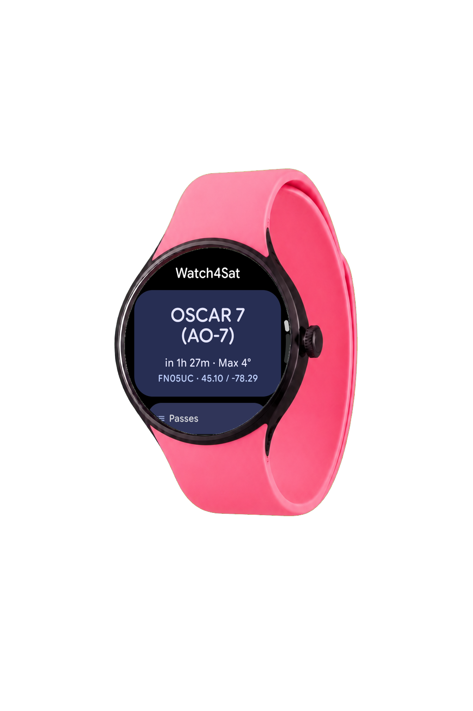
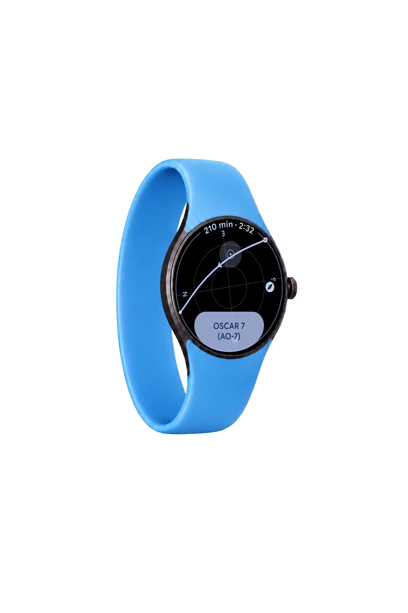
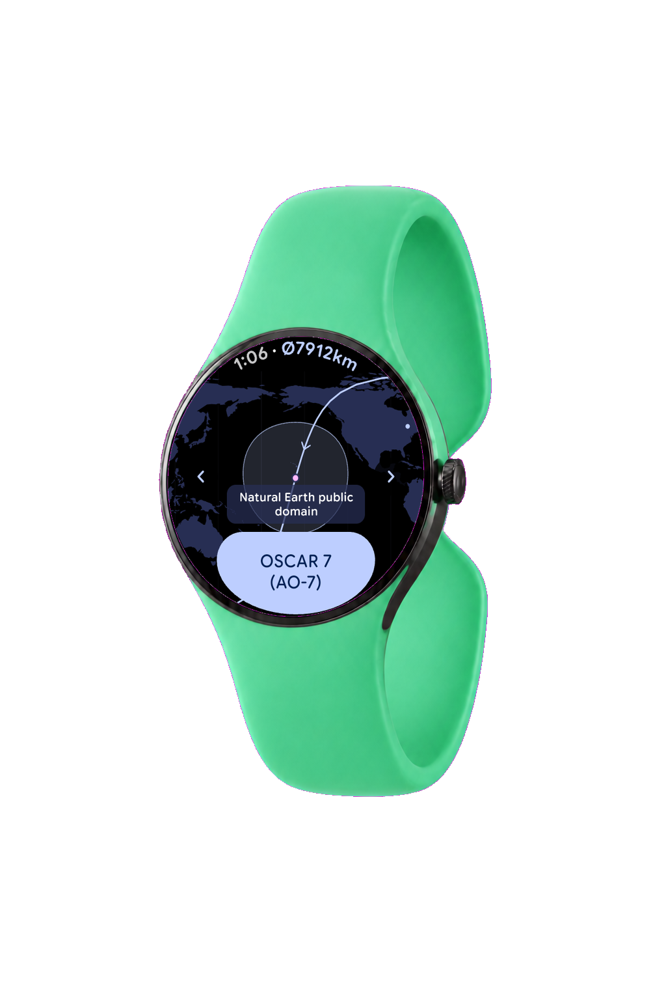
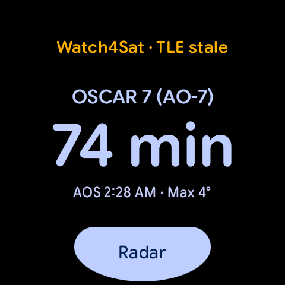
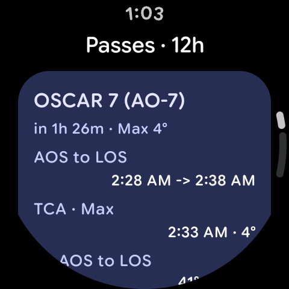
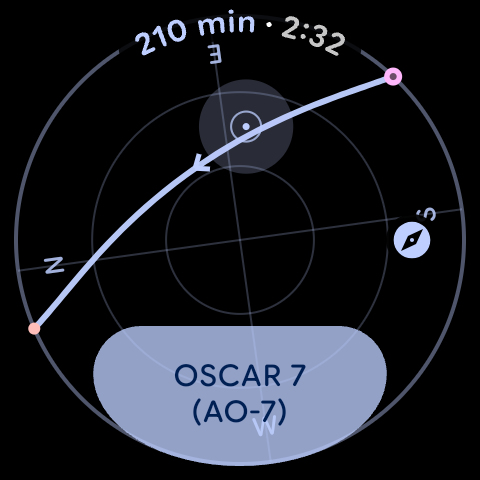
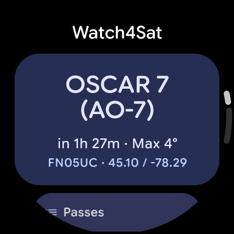
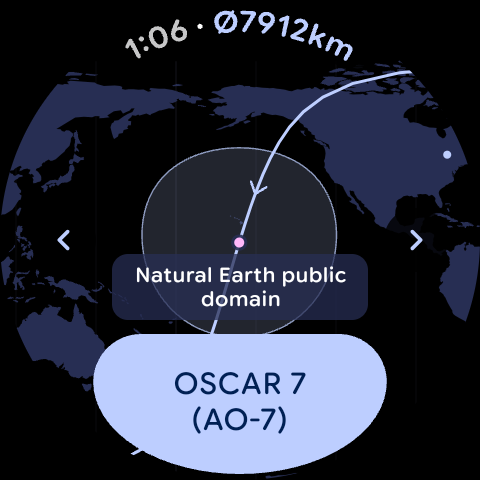
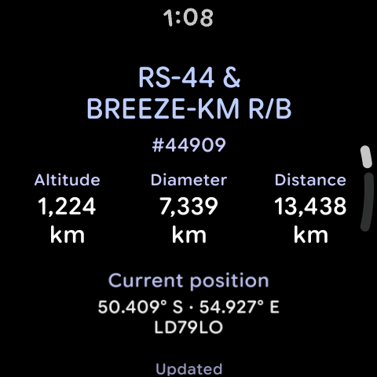

# Watch4Sat

Watch4Sat is a standalone satellite pass tracker for round Wear OS watches. It
puts pass predictions, wrist-guided Radar, orbital ground tracks, radio data,
alerts, and a next-pass Tile directly on the watch without requiring a phone
companion.

**Source checkpoint:** `1.0.0-rc.1` (`versionCode 129`)<br>
**Platform:** Wear OS, Android 11 / API 30 or newer<br>
**License:** GPL-3.0-or-later

<p align="center">
  
  
  
</p>

> [!IMPORTANT]
> This repository currently represents the `1.0.0-rc.1` source checkpoint.
> Signed APK and AAB artifacts have not been published yet. Repository release
> builds are minified, non-debuggable, and unsigned validation artifacts.

## Overview

Watch4Sat is designed for amateur-radio operators, satellite observers, and
anyone who wants useful pass information available at a glance. It can plan an
upcoming pass, guide antenna pointing during the pass, and show a satellite's
ground track and radio data without depending on a paired-phone application.

The interface is English-only and optimized for round Wear OS displays. Core
information remains available through the app, the Next Pass Tile,
notifications, and Ambient mode.

## Features

- Tile-first next-pass countdown with active-pass progress
- Pass lists with AOS, LOS, duration, and maximum elevation
- Configurable pass alerts using system notifications and exact alarms
- Full-screen Radar with live azimuth and elevation guidance
- Wrist-aware Radar orientation for either wearing direction
- Full-screen Orbit Map with smooth satellite switching
- Ground track, footprint diameter, altitude, range, and current position
- Transmitter frequencies and Doppler-adjusted radio information
- GPS, map, coordinate, or locator-based ground-station setup
- Online OpenStreetMap tiles with an embedded offline world-map fallback
- Round-screen Wear Material 3 interface with Ambient support

## Core Workflow

| Phase | Watch4Sat workflow |
| --- | --- |
| **AOS** | Dashboard, Tile, pass list, alerts, and detailed rise/set planning |
| **TCA** | Live azimuth/elevation Radar with wrist-aware orientation and Ambient support |
| **LOS** | Orbit Map, ground track, footprint, live distance, position, and radio data |

## Product Tour

| Next Pass Tile | Pass details | Live Radar |
| --- | --- | --- |
|  |  |  |

| Dashboard | Orbit Map | Orbit details |
| --- | --- | --- |
|  |  |  |

All application images above are authentic captures from the release build on
a Pixel Watch 4. The colorful watch bodies used in the header are original
presentation mockups; they do not replace or modify the application UI.

## Requirements

- A Wear OS watch running Android 11 / API 30 or newer
- Network access when refreshing orbital elements, transmitter metadata, or
  online map tiles
- Location permission only when using GPS to set the ground station
- Notification and exact-alarm access only when pass reminders are enabled
- No paired phone or companion application is required

## Build From Source

Install Android Studio, Android SDK 36, platform tools, and a compatible JDK.
On macOS, the repository helper selects the standard Android Studio and SDK
locations:

```bash
source scripts/watch4sat-env.sh
./gradlew :app-wear:assembleDebug
```

The debug APK is written to:

```text
app-wear/build/outputs/apk/debug/app-wear-debug.apk
```

Install it on a connected watch with:

```bash
adb install -r app-wear/build/outputs/apk/debug/app-wear-debug.apk
```

The ordinary repository release output is unsigned. Maintainer signing is
performed outside the repository; local release builds are not Play Store
production artifacts.

## Testing

Run the JVM suite and assemble the Wear application before submitting a
change:

```bash
source scripts/watch4sat-env.sh
./gradlew test
./gradlew :app-wear:assembleDebug
```

Wear UI changes should also be checked on round API 30 and current Wear OS
devices. Test the affected workflow, system swipe-back, Ambient transitions,
and any relevant Tile or notification behavior.

## Project Structure

| Module | Responsibility |
| --- | --- |
| `app-wear` | Wear OS application, Compose UI, Tile, maps, notifications, and navigation |
| `core-domain` | Orbital prediction, pass planning, Doppler, QTH conversion, and domain models |
| `core-data` | Room, DataStore, network repositories, caches, and pass snapshots |
| `benchmark` | Baseline Profile generation and minified runtime smoke coverage |

Orbital math, pass calculation, QTH conversion, and parsing belong outside
Composable UI code. Tests should be added at the lowest reliable layer for the
behavior being changed.

## Permissions And Privacy

| Access | Why it is used |
| --- | --- |
| Location | Optional GPS-based ground-station setup; manual QTH entry remains available |
| Internet | Refreshes orbital elements, transmitter metadata, and online map tiles |
| Notifications | Shows pass reminders when the user enables them |
| Exact alarms and boot | Schedules enabled pass alerts and restores them after restart or time changes |

Watch4Sat does not require an account and contains no ads, analytics, marketing
SDK, remote crash reporting, or developer-operated backend. Station data and
application state remain on the watch. Application backups and device transfer
are disabled.

The app makes direct HTTPS requests to CelesTrak, SatNOGS DB, and, when
selected, OpenStreetMap tile servers. See the
[privacy policy](https://xianmingfeng.github.io/Watch4Sat/privacy/) for the
complete data-flow, permission, storage, retention, and deletion description.

## Data Sources And Attribution

- Orbital elements: [CelesTrak](https://celestrak.org/)
- Transmitter metadata: [SatNOGS](https://satnogs.org/)
- Online maps: [OpenStreetMap](https://www.openstreetmap.org/) contributors
- Embedded offline land geometry: [Natural Earth](https://www.naturalearthdata.com/)
- Prediction work is inspired by and partially derived from
  [Look4Sat](https://github.com/rt-bishop/Look4Sat)

Look4Sat-derived logic remains subject to GPL-3.0-or-later attribution and
license requirements. Detailed upstream associations, data licenses, font
licensing, and packaged dependency notices are maintained in
[`docs/licenses/`](docs/licenses/). See [NOTICE](NOTICE) for the concise
attribution summary.

## Contributing

Bug reports, focused pull requests, and reproducible device findings are
welcome. Before starting a large feature change, open an issue describing the
user workflow and affected Wear OS versions.

When contributing:

- Keep orbital calculations and data policies outside Composable UI code.
- Add tests at the lowest reliable layer for changed behavior.
- Verify round-screen layouts and preserve English fallback resources.
- Use official Android and Wear Compose patterns where applicable.
- Do not commit signing material, credentials, APKs, or machine-specific SDK
  paths.

## License

Watch4Sat is free software licensed under the
[GNU General Public License v3.0 or later](LICENSE). See [NOTICE](NOTICE) and
the files under [`docs/licenses/`](docs/licenses/) for upstream associations,
attribution, and warranty information.

Copyright (c) 2026 Xianming Feng and Watch4Sat contributors.

## Contact

Release and privacy contact: [ba7lvg@foxmail.com](mailto:ba7lvg@foxmail.com)
